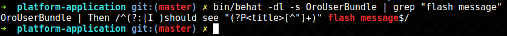

## Health Checkers

Behat a une possibilité native d'invoquer des formateurs sans exécuter les tests et les hooks.

Vous pouvez essayer:

````yaml
 bin/behat --dry-run
````

Cela peut être utile au cas où vous n'êtes pas sûr d'avoir déclaré tout le contexte nécessaire à votre fonctionnalité.
OroBehatExtension améliore cette fonctionnalité et ajoute des fonctionnalités supplémentaires.

## Erreurs

**Erreur courante : Couldn’t generate random unique value for OroBundleUserBundleEntityUser: username in 128 tries** 

hot fix: 

Vérifiez votre fixtures. Supprimez le suffixe (unique) dans la propriété d'entité dans le luminaire d'entité, comme dans l'exemple suivant:

**Fixture incorrect** :

````
yaml
Oro\Bundle\UserBundle\Entity\User:
    charlie:
      firstName: Marge
      lastName: Marge Simpson
      username (unique): marge228
````

**Correction**

````yaml
Oro\Bundle\UserBundle\Entity\User:
    charlie:
      firstName: Marge
      lastName: Marge Simpson
      username: marge228
````

**Erreur racine**

Alice se souvient de toutes les valeurs de la propriété d'entité donnée et essaie de générer une valeur unique, mais cela provoque des problèmes lorsqu'il n'y a qu'une seule valeur pour la propriété d'entité.

Cette option peut toujours être utilisée si elle est combinée avec la fausse valeur générée automatiquement, comme dans l'exemple suivant:

````yaml
Oro\Bundle\UserBundle\Entity\User:
    charlie:
      firstName (unique): <firstName()>
      lastName: Marge Simpson
      username: marge228
````

### Ajouter des extraits

Le développement des fonctionnalités comprend les étapes de conception suivantes:

- Créez un brouillon de la fonctionnalité: implémentez un scénario de haut niveau qui couvre l'histoire. À ce stade, vous devez avoir une compréhension claire des résultats commerciaux obtenus par l'automatisation des tests de fonctionnalités.
- Spécifiez tous les scénarios susceptibles de se produire lors de l'utilisation de la fonction. Les étapes exactes ne sont pas nécessaires.
- Finalisez la vue d'ensemble de la mise en œuvre et planifiez les différentes étapes.

Certaines étapes peuvent déjà être entièrement automatisées. Idéalement, vous devez automatiser les étapes manquantes après avoir prévu de les utiliser dans vos scénarios de test de fonctionnalités. Si la fonctionnalité de fonctionnalité est déjà implémentée, il est nécessaire d'implémenter les étapes behat impliquées dans le test de fonctionnalité.

Cependant, il est parfois impossible de le faire immédiatement (en raison de l'implémentation incomplète des fonctionnalités, des problèmes de blocage ou des informations manquantes). Dans ce cas, vous pouvez temporairement vous moquer des étapes qui manquent d'implémentation.

Un moyen rapide de le faire consiste à exécuter dry-run sur vos tests de fonctionnalités. Dans la console, exécutez la commande suivante:

`bin/behat path/to/your.feature --dry-run --append-snippets --snippets-type=regex`

La fonctionnalité est exécutée en mode –dry-run , au stade final de l'exécution, vous êtes invité à ajouter des étapes de mise en œuvre simulée non définies à l'un des contextes existants.


### Comment trouver l'étape nécessaire


Lorsque vous concevez des scénarios d'automatisation de test pour la nouvelle fonctionnalité, vous pouvez avoir du mal à trouver des étapes à réutiliser parmi les centaines d'étapes déjà automatisées.
Utilisez les conseils ci-dessous pour trouver l'étape nécessaire.

Suggestion automatique dans PhpStorm

Lors de la conception d'un scénario dans le fichier de fonctionnalités, PhpStorm vous propose des conseils sur les étapes implémentées qui correspondent aux mots clés. Par exemple, lorsque vous tapez grid ou form, les étapes qui impliquent ces éléments apparaissent dans le bloc de suggestions.


Si PhpStorm ne vous propose aucun conseil lors de la frappe, veuillez vérifier les points suivants:

1. Vous avez installé les vendors
2. Vous avez installé le plugin behat pour PhpStorm

Trouvez le contexte nécessaire

Chaque classe Context doit implémenter l'interface `Behat\Behat\Context\Context`. Obtenez la liste des contextes implémentés et trouvez celui nécessaire par nom.


Habituellement, le nom du contexte est explicite, par exemple, GridContext, FormContext, ACLContext, etc.

Utiliser Grep dans la console

Si, pour une raison quelconque, vous n'utilisez pas PhpStorm ou le plugin Behat, vous pouvez toujours trouver l'étape nécessaire en filtrant la sortie de la commande qui prévisualise toutes les étapes de la fonctionnalité (utilisez Grep).

Tapez la commande suivante dans votre console:

`bin/behat -dl -s AcmeDemoBundle | grep "flash message"`



`bin/behat -dl -s AcmeDemoBundle | grep "grid"`


PS :  Vous ne pouvez utiliser l'interface de ligne de commande behat qu'après avoir installé l'application.