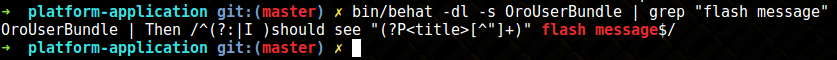

# Test Behat

## Concepts

Les informations ci-dessous résume les concepts et les outils qui sont importants pour la compréhension et l’utilisation
du framework de test inclus dans OroBehatExtension.

**Behavior-driven development (BDD)** est un processus de développement logiciel issu du développement axé sur les tests (TDD).
Le BDD combine les techniques générales et les principes de TDD avec des idées de conception axée sur le domaine et
l'analyse d'objet et du design pour fournir aux équipes de développement et de gestion de logiciels des outils partagés et 
un processus partagé de collaboration pour le développement de logiciels.

1. [Behat](https://docs.behat.org/en/v3.0/) est un framework de développement basé sur le comportement pour PHP.
Cet outil permet de décrire le comportement de l'application voulue en utilisant Php et [Gherking](https://docs.behat.org/en/latest/user_guide/gherkin.html)
Vous pouvez utiliser Behat pour décrire tout ce que vous pouvez décrire dans la logique métier.
Outils, applications GUI, applications Web, etc. La partie la plus intéressante est les applications Web.

2. [Mink](http://mink.behat.org/en/latest/) est une extension de Behat qui vas permettre de controller un navigateur durant les tests en utilisant PHP.
Il vas utiliser des emulateurs de navigateurs , l'avantage d'utiliser Mink c'est qu'il supprime les différences entres les 
différents emulateurs de navigateur et leurs drivers.

3. [OroElementFactory](https://github.com/oroinc/platform/blob/master/src/Oro/Bundle/TestFrameworkBundle/Behat/Element/OroElementFactory.php) est une classe qui permet de manipuler des éléments sur la page.

4. [Symfony2Extension](https://github.com/Behat/Symfony2Extension/blob/master/doc/index.rst) qui ajoute une intégration pour Symfony avec Behat.

5. [OroTestFrameworkExtension](https://github.com/oroinc/platform/blob/master/src/Oro/Bundle/TestFrameworkBundle/Behat/ServiceContainer/OroTestFrameworkExtension.php) vas permettre de charger différents outils pour la liaison Oro/Behat

6. [MinkSelenium2Driver](https://github.com/minkphp/MinkSelenium2Driver) vas faire le lien entre Mink vers Selenium en utilisant le protocole WebDriver

7. [ChromeDriver](https://sites.google.com/a/chromium.org/chromedriver/) est un outil pour automatiser les tests dans Goodle Chrome


## Conventions

Cette section résume les limitations et accords importants pour la maintenance et l'utilisation des tests partagés.

Utilisez le mapping de formulaire au lieu de sélecteurs dans vos scénarios pour les garder clairs et compréhensibles pour les personnes du monde technique et non technique.

### Example 

Ne pas:

```
I fill in "oro_workflow_definition_form[label]" with "User Workflow Test"
I fill in "oro_workflow_definition_form[related_entity]" with "User"
```

Mais plutot :

```
 And I fill "Workflow Edit Form" with:
   | Name                  | User Workflow Test |
   | Related Entity        | User               |
```

avec la description des éléments indépendament :

```
 Workflow Edit Form:
   selector: 'form[name="oro_workflow_definition_form"]'
   class: Oro\Bundle\TestFrameworkBundle\Behat\Element\Form
   options:
     mapping:
       Name: 'oro_workflow_definition_form[label]'
       Related Entity: 'oro_workflow_definition_form[related_entity]'
```

Utilisez des menu et des liens pour obtenir les bonnes pages au lieu de l'URL de la page directe

Faire :

```
And I open User Index page
```

Et non pas :

```
And I go to "/users"
```

Évitez la redondance des scénarios (par exemple, en répétant la même séquence d'étapes, comme la connexion, dans plusieurs scénarios).

Couvrez la fonctionnalité avec les scénarios séquentiels où chaque scénario suivant réutilise les résultats (les états et les données) préparés par leurs prédécesseurs. Cette méthode a été choisie en raison des avantages suivants:

- Exécution de scénario plus rapide grâce à la session utilisateur partagée et à la préparation intelligente des données.
L'action de connexion dans le scénario initial ouvre la session qui est réutilisable par les scénarios suivants.
Les scénarios préliminaires (par exemple, créer) préparent des données pour les scénarios suivants (par exemple, supprimer).
- L'isolation au niveau des fonctionnalités augmente la vitesse d'exécution, en particulier dans les environnements de test lents.
- Actions de développement de routine minimisées (par exemple, vous n'avez pas à charger les fixtures pour chaque scénario; au lieu de cela, vous réutilisez les résultats disponibles des scénarios précédents).
- Gestion aisée des états d'application difficiles à émuler uniquement avec des fixtures (par exemple, lors de l'ajout de nouveaux champs d'entité dans l'interface utilisateur).


En couplant les scénarios, la facilité de débogage et de localisation des bogues est réduite. Il est difficile de déboguer les fonctionnalités de l'interface utilisateur
et les scénarios qui se produisent après plusieurs scénarios préliminaires. Plus la ligne est longue, plus il est difficile d'isoler le problème.

- **Utiliser des fixtures yml sémantiques**

Utilisez uniquement les entités qui se trouvent dans le bundle que vous testez. Toutes les autres entités doivent être incluses via une importation. Voir les [Fixtures Alince](https://github.com/nelmio/alice) pour plus d'informations.

- **Nommer les éléments dans le style camelCase sans espaces**

Vous pouvez toujours vous y référer en utilisant le style camelCase avec des espaces dans les scénarios behat.
Par exemple, un élément nommé OroProductForm peut être mentionné dans l'étape du scénario comme «Oro Product From»:

- **Use Scenario: Feature Background instead of the Background step**

## Introduction

### Configuration

**Configuration de l'application** :

Utilisez la configuration par défaut de l'application installée en mode production. Si aucun serveur de messagerie n'est configuré localement, définissez le paramètre mailer_transport dans parameters.yml sur null.

**Configuration Behat**

La configuration de base se trouve dans behat.yml.dist. Chaque application possède son propre fichier behat.yml.dist à la racine du répertoire de l'application.
Créez votre behat.yml (il est ignoré par git automatiquement et n'est jamais validé dans le référentiel distant), importez la configuration de base et modifiez-la pour l'adapter à votre environnement:

```yaml
imports:
   - ./behat.yml.dist

 default: &default
     extensions: &default_extensions
         Behat\MinkExtension:
             browser_name: chrome
             base_url: "http://your-domain.local"
```

## Installation

### Installation des dépendances de développement :


Si vous avez installé des dépendances avec le paramètre --no-dev plus tôt, supprimez le fichier composer.lock de la racine du répertoire de l'application.


Installez les dépendances dev à l'aide de la commande suivante

`composer install`

### Etat de l'application initiale 

Dans Oro, l'état initial est celui lorsque l'application est installé sans données de démonstration.
Les scénarios qui testent des fonctionnalités doivent s'appuyer sur cet état et doivent créer toutes les données nécessaires à des vérifications supplémentaires.
Les données peuvent être créées par les étapes du scénario ou comme montages.


Installez l'application sans données de démonstration en mode production à l'aide de la commande suivante:

```
 bin/console oro:install  --drop-database --user-name=admin --user-email=admin@example.com  \
   --application-url=http://dev-crm.local --user-firstname=John --user-lastname=Doe \
   --user-password=admin  --organization-name=ORO --env=prod --sample-data=n --timeout=3000
```

### Install Test Automation Tools

Pour exécuter des scénarios qui utilisent les fonctionnalités de l'application Oro, exécutez le navigateur WebKit (à l'aide de ChromeDriver). Pour installer ChromeDriver, exécutez les commandes suivantes:

```
 CHROME_DRIVER_VERSION=$(curl -sS chromedriver.storage.googleapis.com/LATEST_RELEASE)
 mkdir -p "$HOME/chrome" || true
 wget "http://chromedriver.storage.googleapis.com/${CHROME_DRIVER_VERSION}/chromedriver_linux64.zip" -O "$HOME/chrome/chromedriver_linux64_${CHROME_DRIVER_VERSION}.zip"
 unzip "$HOME/chrome/chromedriver_linux64_${CHROME_DRIVER_VERSION}.zip" -d "$HOME/chrome"
 sudo ln -s "$HOME/chrome/chromedriver" /usr/local/bin/chromedriver
```

### Note :

Ces commandes créent un sous-répertoire pour Chrome dans votre répertoire personnel, télécharge ChromeDriver dans le répertoire créer,décompresse les fichiers et créér un lien symbolique.


Une fois l'exécution de la commande terminée, vous pouvez utiliser `chromedriver dans le terminal.`

### Exécution des tests

Conditions préalables

Exécutez ChromeDriver:

`chromedriver --url-base=wd/hub --port=4444 > /tmp/driver.log 2>&1`

Pour exécuter ChromeDriver en arrière-plan, ajoutez le symbole esperluette (&) à la fin de la ligne, comme dans les exemples suivants:

`chromedriver --url-base=wd/hub --port=4444 > /tmp/driver.log 2>&1 &`


Avant de commencer, il est fortement recommandé de vous familiariser avec les arguments et les options de Behat. Exécutez bin / behat --help pour une description détaillée.

Lorsque l'application Oro est installée sans données de démonstration et est en cours d'exécution, et que ChromeDriver est en cours d'exécution, vous pouvez commencer à exécuter les tests behat par fonctionnalité à partir de la racine de l'application.

Vous pouvez utiliser l'une des commandes suivantes.

Exécutez le scénario de test des fonctionnalités:

`bin/behat vendor/oro/platform/src/Oro/Bundle/UserBundle/Tests/Behat/Features/login.feature -vvv`

Aperçu de toutes les étapes de fonctionnalité disponibles:

`bin/behat -dl -s OroUserBundle`

Voir les étapes avec une description complète et des exemples:

`bin/behat -di -s OroUserBundle`


Chaque bundle a sa suite de tests dédiée qui peut être exécutée séparément:

`bin/behat -s OroUserBundle`

## Architecture

## Container

Behat est une application console Symfony avec son propre conteneur et ses propres services.
Un conteneur Behat peut être configuré via des extensions en utilisant behat.yml à la racine du répertoire d'application.


Le conteneur d'application peut être utilisé par le noyau injecté dans votre contexte après avoir implémenté KernelAwareContext et utilisé le trait KernelDictionary.

```php
 use Behat\Symfony2Extension\Context\KernelAwareContext;
 use Behat\Symfony2Extension\Context\KernelDictionary;
 use Oro\Bundle\TestFrameworkBundle\Behat\Context\OroFeatureContext;

 class FeatureContext extends OroFeatureContext implements KernelAwareContext
 {
     use KernelDictionary;

     public function useContainer()
     {
         $doctrine = $this->getContainer()->get('doctrine');
     }
 }
```


De plus, vous pouvez injecter des services dans le contexte behat:

````yaml
 oro_behat_extension:
   suites:
     OroCustomerAccountBridgeBundle:
       contexts:
         - OroImportExportBundle::ImportExportContext:
             - '@oro_entity.entity_alias_resolver'
             - '@oro_importexport.processor.registry'
````

## Autoload Suites

La classe [OroTestFrameworkExtension](https://github.com/oroinc/platform/blob/master/src/Oro/Bundle/TestFrameworkBundle/Behat/ServiceContainer/OroTestFrameworkExtension.php)
est responsable de la génération des suites de test.

Lors de l'initialisation, l'extension crée une suite de tests avec un nom de bundle si un répertoire Tests/Behat/Features
existe dans un bundle. Ainsi, si le bundle n'a pas de répertoire Features - aucune suite de tests ne sera créée ce bundle.

Si vous avez besoin de certaines étapes de fonctionnalité spécifiques pour votre bundle, créez la classe AcmeDemoBundle\Tests\Behat\Context\FeatureContext.
Ce contexte est ajouté à la suite avec les contextes courants.La liste complète du contexte commun est configurée dans le fichier de configuration behat sous la clé `shared_contexts`.

Vous pouvez configurer manuellement la suite de tests pour un bundle dans la configuration de l'application behat:

```yaml
 default: &default
   suites:
     AcmeDemoBundle:
       type: symfony_bundle
       bundle: AcmeDemoBundle
       contexts:
         - Oro\Bundle\TestFrameworkBundle\Tests\Behat\Context\OroMainContext
         - OroDataGridBundle::GridContext
         - AcmeDemoBundle::FeatureContext
       paths:
         - 'vendor/Acme/DemoBundle/Tests/Behat/Features'
```

ou dans une configuration de bundle behat {BundleName}/Tests/Behat/behat.yml :

````yaml
 oro_behat_extension:
   suites:
     AcmeDemoBundle:
       contexts:
         - Oro\Bundle\TestFrameworkBundle\Tests\Behat\Context\OroMainContext
         - OroDataGridBundle::GridContext
         - AcmeDemoBundle::FeatureContext
       paths:
         - '@AcmeDemoBundle/Tests/Behat/Features'
````

Les suites de test configurées manuellement ne sont pas chargées automatiquement par l'extension.

### Feature Isolation


Chaque fonctionnalité peut interagir avec l'application et effectuer des opérations CRUD. Par conséquent, la base de données peut être modifiée.
Pour éviter les collisions de données, les fonctionnalités sont isolées: la base de données et les répertoires de cache sont vidés avant d'exécuter les tests de fonctionnalités;
ils sont restaurés une fois l'exécution des tests de fonctionnalités terminée.

Chaque isolateur doit implémenter l'interface Oro\Bundle\TestFrameworkBund et le tag oro_behat.isolator avec de la priorité.

#### Désactiver l'isolation des fonctionnalités

Vous pouvez désactiver l'isolation des fonctionnalités en ajoutant l'option `-skip-isolators=database,cache` à la commande console behat.
Dans ce cas, la combinaison des tests de fonctionnalité peut s'exécuter beaucoup plus rapidement, mais la logique de test doit se soucier de la cohérence de la base de données et du cache.

## Objet de page (Page Object)

### Elements

Elements est une couche de service dans les tests behat. Ils enveloppent la logique métier complexe. Prenez une minute pour lire la base des [NodeElement Mink](https://github.com/minkphp/Mink/blob/9ea1cebe3dc529ba3861d87c818f045362c40484/src/Element/NodeElement.php)

Il y a de nombreuses méthodes publiques; certains d'entre eux ne s'appliquent qu'à certains éléments. Chaque test Bundle peut contenir un nombre particulier d'éléments.
Tous les éléments doivent être décrits dans {BundleName} {BundleName}/Tests/Behat/behat.yml de la manière suivante:

````yaml
 oro_behat_extension:
   elements:
     Login:
       selector: '#login-form'
       class: Oro\Bundle\TestFrameworkBundle\Behat\Element\Form
       options:
         mapping:
           Username: '_username'
           Password: '_password'
````

ou :

1. `Login` est un nom d'élément qui DOIT être unique. L'élément peut être créé dans un contexte par OroElementFactory par son nom:

````php
$this->elementFactory->createElement('Login');
````

2. selector` définit comment le driver Web doit trouver l'élément sur la page. Par défaut, lorsque le type de sélecteur n'est pas spécifié, le sélecteur css est utilisé.
Le sélecteur XPath est également pris en charge et peut être fourni avec la configuration suivante:

```yaml
 selector:
     type: xpath
     locator: //span[id='mySpan']/ancestor::form/
```
3. Le namespace de l'élément (doit être étendu à partir de Oro\Bundle\TestFrameworkBundle\Behat\Element\Element`).
Lorsqu'elle est omise, la classe `Oro\Bundle\TestFrameworkBundle\Behat\Element\Element` est utilisée par défaut.

4. `options` est un tableau d'options supplémentaires stockées dans la propriété options de la classe Element.
Il est fortement recommandé de fournir une classe avec des options de mappage pour les éléments de formulaire, car cela augmente la vitesse de test et garantit un mappage de champ plus précis.

## Mappage des champs de formulaire

Par défaut, les tests utilisent le [sélecteur de champ nommé](http://mink.behat.org/en/latest/guides/traversing-pages.html#named-selectors)  pour mapper les champs du formulaire.
Le sélecteur de nom de champ a recherché le champ par son identifiant, son nom, son label ou son placeholder.
Vous êtes libre d'utiliser n'importe quel sélecteur pour mapper des champs de formulaire ou encapsuler un élément dans l'élément behat particulier.

```yaml
 oro_behat_extension:
   elements:
     Payment Method Config Type Field:
       class: Oro\Bundle\PaymentBundle\Tests\Behat\Element\PaymentMethodConfigType
     PaymentRuleForm:
       selector: "form[id^='oro_payment_methods_configs_rule']"
       class: Oro\Bundle\TestFrameworkBundle\Behat\Element\Form
       options:
         mapping:
           Method:
             type: 'xpath'
             locator: '//div[@id[starts-with(.,"uniform-oro_payment_methods_configs_rule_method")]]'
             element: Payment Method Config Type Field
```

Vous devez maintenant implémenter la méthode `setValue` de l'élément:

````php
<?php
 namespace Oro\Bundle\PaymentBundle\Tests\Behat\Element;
 use Oro\Bundle\TestFrameworkBundle\Behat\Element\Element;
 class PaymentMethodConfigType extends Element
 {
     /**
      * {@inheritdoc}
      */
     public function setValue($value)
     {
         $values = is_array($value) ? $value : [$value];
         foreach ($values as $item) {
             $parentField = $this->getParent()->getParent()->getParent()->getParent();
             $field = $parentField->find('css', 'select');
             self::assertNotNull($field, 'Select payment method field not found');
             $field->setValue($item);
             $parentField->clickLink('Add');
             $this->getDriver()->waitForAjax();
         }
     }
 }
````

Vous pouvez maintenant l'utiliser dans une étape standard:

```yaml
 Feature: Payment Rules CRUD
   Scenario: Creating Payment Rule
     Given I login as administrator
     And I go to System/ Payment Rules
     And I click "Create Payment Rule"
     When I fill "Payment Rule Form" with:
       | Method | PayPal |
```

### Mappages de formulaires intégrés : 

Parfois, un formulaire apparaît dans l'iframe. Behat peut passer à l'iframe par son identifiant.
Pour remplir correctement le formulaire dans l'iframe, spécifiez l'id iframe dans les options du formulaire:

````yaml
   oro_behat_extension:
     elements:
       MagentoContactUsForm:
         selector: 'div#page'
         class: Oro\Bundle\TestFrameworkBundle\Behat\Element\Form
         options:
           embedded-id: embedded-form
           mapping:
             First name: 'oro_magento_contactus_contact_request[firstName]'
             Last name: 'oro_magento_contactus_contact_request[lastName]'
````

## ELement de page


L'élément Page encapsule la page Web entière avec son URL et son chemin d'accès à la page. Chaque élément Page doit étendre `Oro\Bundle\TestFrameworkBundle\Behat\Element\Page`.

Exemple de Configuration de Page :

```yaml
 oro_behat_extension:
   pages:
     UserProfileView:
       class: Oro\Bundle\UserBundle\Tests\Behat\Page\UserProfileView
       route: 'oro_user_profile_view'
```
Exemple de classe de page:

```php
 namespace Oro\Bundle\UserBundle\Tests\Behat\Page;

 use Oro\Bundle\TestFrameworkBundle\Behat\Element\Page;

 class UserProfileView extends Page
 {
     /**
      * {@inheritdoc}
      */
     public function open(array $parameters = [])
     {
         $userMenu = $this->elementFactory->createElement('UserMenu');
         $userMenu->find('css', '[data-toggle="dropdown"]')->click();

         $userMenu->clickLink('My User');
     }
 }
```
Vous pouvez maintenant utiliser plusieurs étapes significatives:

````yaml
 And I open User Profile View page
 And I should be on User Profile View page
````

## Fixtures :

### Feature Fixtures :

Chaque fois que behat exécute une nouvelle fonctionnalité, l'état de l'application est réinitialisé par défaut :
il n'y a qu'un seul utilisateur administrateur, une organisation, une unité commerciale et des rôles par défaut dans la base de données.

Les tests de fonctionnalités doivent s'appuyer sur les données disponibles dans l'application après l'exécution de la commande oro: install. Dans la plupart des cas, cela ne suffit pas.

Ainsi, vous avez deux façons d'obtenir plus de données dans le système: en utilisant des fixtures de base ou des fixtures alice.

### Fixtures basiques 

Vous pouvez créer un nombre quelconque d'entités dans les tests de fonctionnalités. `FixtureContext` devine la classe d'entité, crée le nombre nécessaire d'objets
et utilise [faker](https://github.com/fzaninotto/faker) pour remplir les champs requis lorsque leur valeur n'a pas été spécifiée explicitement.

Vous utilisez à la fois les références faker et les [ références d'entité](https://doc.oroinc.com/master/backend/automated-tests/behat/#behat-entity-references) dans les appareils en ligne.

````
 Given the following contacts:
   | First Name | Last Name | Email     |
   | Joan       | Anderson  | <email()> |
   | Craig      | Bishop    | <email()> |
   | Jean       | Castillo  | <email()> |
   | Willie     | Chavez    | <email()> |
   | Arthur     | Fisher    | <email()> |
   | Wanda      | Ford      | <email()> |
 And I have 5 Cases
 And there are 5 calls
 And there are two users with their own 7 Accounts
 And there are 3 users with their own 3 Tasks
 And there is user with its own Account
````

### Fixtures Alice


Parfois, vous avez besoin de nombreuses entités différentes avec des relations complexes. Dans de tels cas, vous pouvez utiliser des fixtures Alice.
 Alice est une bibliothèque qui vous permet de créer facilement des fixtures au format yml.

#### NOTE : 
Voir la [documentation d'Alice](https://github.com/nelmio/alice/blob/2.x/README.md) pour plus d'informations.

Les fixtures doivent être situés dans le répertoire {BundleName}/Tests/Behat/Features/Fixtures. Pour charger une fixture avant l'exécution des tests de fonctionnalité,
ajoutez une balise (annotation) qui est construite à l'aide de la convention suivante `@fixture-BundleName:fixture_file_name.yml`, par exemple:

````yaml
 @fixture-OroCRMBundle:mass_action.yml
 Feature: Mass Delete records
````

Il est également possible de charger des fixtures pour tout autre bundle disponible pour l'application.

Par exemple:

```yaml
 @fixture-OroUserBundle:user.yml
 @fixture-OroOrganizationBundle:BusinessUnit.yml
 Feature: Adding attributes for workflow transition
```

De plus, Alice vous permet [d'inclure des fichiers](https://github.com/nelmio/alice/blob/a060587f3c90edd92a65c6c0d163972f49bc4e21/doc/fixtures-refactoring.md#including-files) via l'extension, vous pouvez donc importer des fichiers à partir d'autres bundles:

```yaml
 include:
     - '@OroCustomerBundle/Tests/Behat/Features/Fixtures/CustomerUserAmandaRCole.yml'
```

**Vous devez toujours inclure les fixtures d'autres bundles avec des entités qui ont été déclarées dans ce bundle**

## Références d'entités


Vous pouvez utiliser des références aux entités dans les fixtures de base et [alice](https://github.com/nelmio/alice/blob/2.x/doc/relations-handling.md#handling-relations).

`{Bundle}\Tests\Behat\ReferenceRepositoryInitializer`  est utilisé pour créer des références pour des objets qui existent déjà dans la base de données.


- Il est interdit de modifier ou d'ajouter de nouvelles entités dans le  Initializer.
- Il doit implémenter `ReferenceRepositoryInitializerInterface` et ne doit pas avoir de dépendances.
- Pour afficher toutes les références, utilisez la commande `bin/behat --available-references`.

Les références les plus utilisées sont:

- `@admin `- Utilisateur Admin
- `@adminRole` - Administrator role
- `@organization` - Default organization
- `@business_unit` - Default business unit

## Health Checkers


Behat a une possibilité native d'invoquer des formateurs sans exécuter les tests et les hooks.

Vous pouvez essayer:

````yaml
 bin/behat --dry-run
````

Cela peut être utile au cas où vous n'êtes pas sûr d'avoir déclaré tout le contexte nécessaire à votre fonctionnalité.
OroBehatExtension améliore cette fonctionnalité et ajoute des fonctionnalités supplémentaires.

### FixturesChecker

Chaque fonctionnalité peut avoir des fixtues Alice, ajoutés par des tags. **FixturesChecker** vérifiera chaque fonctionnalité pour la capacité de charger des appareils, sans réellement charger la fixture.

### Ecrire une feature

Chaque bundle doit contenir ses propres tests behat pour les fonctionnalités du répertoire `wn behat tests for features in the `.
Chaque fonctionnalité est un fichier distinct avec l'extension `.feature` et une syntaxe spécifique.

#### Note : 

Voir la doc de [Cucumber](https://cucumber.io/docs/) pour plus d'infos.

Une fonctionnalité commence par ce qui suit:

- Le mot clé `Feature`: et le nom de la fonctionnalité (ceux-ci doivent rester sur la même ligne),
- Une description facultative (peut être formatée sur plusieurs lignes). Une description significative est fortement recommandée.

Vient ensuite le scénario de fonctionnalité - un exemple spécifique qui illustre une règle métier et se compose d'étapes séquentielles.
En plus d'être une spécification de test et une documentation de test, un scénario définit les étapes de test et sert de spécification exécutable du système.

Normalement, une étape commence par **Given**, **When** ou **Then**.

S'il existe plusieurs étapes Given ou When les unes sous les autres, vous pouvez utiliser **And** ou **But** pour les organiser en groupes logiques.
Cucumber ne fait pas de différence entre les mots clés, mais le choix du bon est important pour la lisibilité du scénario dans son ensemble.

#### Note : 
Jetez un œil à la feature login `login.feature` dans [OroUserBundle](https://github.com/oroinc/platform/blob/50047c1d8abc5f811d0db759b501b8d27b0bff65/src/Oro/Bundle/UserBundle/Tests/Behat/Features/login.feature)


````
Feature: User login
   In order to login in application
   As an OroCRM admin
   I need to be able to authenticate

 Scenario: Success login
   Given I am on "/user/login"
   When I fill "Login Form" with:
       | Username | admin |
       | Password | admin |
   And I press "Log in"
   Then I should be on "/"

 Scenario Outline: Fail login
   Given I am on "/user/login"
   When I fill "Login Form" with:
       | Username | <login>    |
       | Password | <password> |
   And I press "Log in"
   Then I should be on "/user/login"
   And I should see "Invalid user name or password."

   Examples:
   | login | password |
   | user  | pass     |
   | user2 | pass2    |
````

1. La ligne `Feature: User login` démarre la fonctionnalité et lui donne un titre.
2. Behat n'analyse pas les trois lignes de texte suivantes: In order to... As an... I need to...
Ces lignes fournissent un contexte lisible par l'homme aux personnes qui réviseront ou modifieront cette fonctionnalité. Ils décrivent la valeur commerciale dérivée de l'inclusion de la fonctionnalité dans le logiciel.
3. La ligne `Scenario: Success login` démarre le scénario et fournit une description.
4. Les six lignes suivantes représentent les étapes du scénario. Chaque étape correspond à une expression régulière définie dans le contexte.
5. La ligne `Scenario Outline: Fail login` démarre le scénario suivant. Dans le plan du scénario, les placeholders sont utilisés à la place des valeurs réelles
et les valeurs pour l'exécution du scénario sont fournies sous la forme d'un ensemble d'exemples sous le plan.
Le scénario vous aide à exécuter ces étapes plusieurs fois, en parcourant les valeurs fournies dans la section `Exemples:` et en testant ainsi le même flux avec des entrées différentes.
Le plan du scénario est un modèle qui n'est jamais exécuté seul.
Au lieu de cela, un scénario qui suit un plan s'exécute une fois pour chaque ligne dans la section `Exemples:` en dessous (à l'exception de la première ligne d'en-tête qui est ignorée).
Considérez un espace réservé comme une variable. Il est remplacé par une valeur réelle depuis `Exemples:`, où le texte entre les crochets d'angle de l'espace réservé (par exemple, <login>) correspond au texte de l'en-tête de la colonne du tableau (par exemple, login).

## Dépannage

### Augmentez les performances des applications (Ubuntu)

Behat a des isolateurs pour rendre les fonctionnalités de behat indépendantes les unes des autres. L'un de ces isolateurs est la base de données.
Il crée un vidage de base de données avant le début de l'exécution, puis le supprime et le restaure à partir du vidage après chaque fonctionnalité.
Cela peut prendre un certain temps (jusqu'à 2 minutes sur un SSD lent). Si vous exécutez souvent des tests behat, vous souhaitez diminuer ce temps.
Pour booster l'isolateur de base de données, vous pouvez monter le répertoire de la base de données sur la RAM. Dans l'illustration ci-dessous, nous utilisons [tmpfs](https://en.wikipedia.org/wiki/Tmpfs):

Créez un répertoire tmpfs:

```
sudo mkdir /var/tmpfs
sudo mount -t tmpfs -o size=4G tmpfs /var/tmpfs
```

Editez `/etc/mysql/mysql.conf.d/mysqld.cnf`

`datadir = /var/tmpfs/mysql`

Ajoutez un nouveau stockage à `/etc/fstab`:

`tmpfs  /var/tmpfs  tmpfs  nodev,nosuid,noexec,noatime,size=4G  0 0`

Copiez MySQL dans tmpfs:

```
sudo service mysql stop
sudo cp -Rfp /var/lib/mysql /var/tmpfs
```

Nous devons dire à AppArmor de laisser MySQL écrire dans le nouveau répertoire en créant un alias entre le répertoire par défaut et le nouvel emplacement.

`echo "alias /var/lib/mysql/ -> /var/tmpfs/mysql," | sudo tee -a /etc/apparmor.d/tunables/alias`

Pour que les modifications prennent effet, redémarrez AppArmor:

`sudo systemctl restart apparmor`

Vous pouvez maintenant redémarrer MySQL:

`sudo service mysql start`

#### (facultatif) Créer un script de démarrage 

Après avoir redémarré l'ordinateur, toutes les données et la structure de la base de données sont perdues. Par conséquent, vous devez copier le répertoire de données manuellement après chaque redémarrage.
Alternativement, vous pouvez créer un script de démarrage qui peut être lancé automatiquement en tant que service systemd.

Pour préparer la récupération automatique à l'aide d'un script de démarrage:

1. Créez un mysql_copy_tmpfs.sh dans le répertoire bin (par exemple /usr/local/bin):

````shell script
#!/bin/bash
cp -Rfp /var/lib/mysql /var/tmpfs
````

2. Créez un fichier de configuration d'unité /etc/systemd/system/mysql_copy_tmpfs.service qui planifiera la priorité de l'exécution du service avant le démarrage de MySQL:
```
[Unit]
Description=Copy mysql to tmpfs
Before=mysql.service
After=mount.target

[Service]
User=mysql
Type=oneshot
ExecStart=/bash/script/path/mysql_copy_tmpfs.sh

[Install]
WantedBy=multi-user.target
```

3. Une fois les fichiers créés, activez le service configuré:

`systemctl enable mysql_copy_tmpfs.service`

Il démarre automatiquement après le redémarrage de la machine.

**Erreur courante : Couldn’t generate random unique value for OroBundleUserBundleEntityUser: username in 128 tries** 

hot fix: 

Vérifiez votre fixtures. Supprimez le suffixe (unique) dans la propriété d'entité dans le luminaire d'entité, comme dans l'exemple suivant:

**Fixture incorrect** :

````yaml
Oro\Bundle\UserBundle\Entity\User:
    charlie:
      firstName: Marge
      lastName: Marge Simpson
      username (unique): marge228
````

**Correction**

````yaml
Oro\Bundle\UserBundle\Entity\User:
    charlie:
      firstName: Marge
      lastName: Marge Simpson
      username: marge228
````

**Erreur racine**

Alice se souvient de toutes les valeurs de la propriété d'entité donnée et essaie de générer une valeur unique, mais cela provoque des problèmes lorsqu'il n'y a qu'une seule valeur pour la propriété d'entité.

Cette option peut toujours être utilisée si elle est combinée avec la fausse valeur générée automatiquement, comme dans l'exemple suivant:

````yaml
Oro\Bundle\UserBundle\Entity\User:
    charlie:
      firstName (unique): <firstName()>
      lastName: Marge Simpson
      username: marge228
````

### Ajouter des extraits

Le développement des fonctionnalités comprend les étapes de conception suivantes:

- Créez un brouillon de la fonctionnalité: implémentez un scénario de haut niveau qui couvre l'histoire. À ce stade, vous devez avoir une compréhension claire des résultats commerciaux obtenus par l'automatisation des tests de fonctionnalités.
- Spécifiez tous les scénarios susceptibles de se produire lors de l'utilisation de la fonction. Les étapes exactes ne sont pas nécessaires.
- Finalisez la vue d'ensemble de la mise en œuvre et planifiez les différentes étapes.

Certaines étapes peuvent déjà être entièrement automatisées. Idéalement, vous devez automatiser les étapes manquantes après avoir prévu de les utiliser dans vos scénarios de test de fonctionnalités. Si la fonctionnalité de fonctionnalité est déjà implémentée, il est nécessaire d'implémenter les étapes behat impliquées dans le test de fonctionnalité.

Cependant, il est parfois impossible de le faire immédiatement (en raison de l'implémentation incomplète des fonctionnalités, des problèmes de blocage ou des informations manquantes). Dans ce cas, vous pouvez temporairement vous moquer des étapes qui manquent d'implémentation.

Un moyen rapide de le faire consiste à exécuter dry-run sur vos tests de fonctionnalités. Dans la console, exécutez la commande suivante:

`bin/behat path/to/your.feature --dry-run --append-snippets --snippets-type=regex`

La fonctionnalité est exécutée en mode –dry-run , au stade final de l'exécution, vous êtes invité à ajouter des étapes de mise en œuvre simulée non définies à l'un des contextes existants.


### Comment trouver l'étape nécessaire


Lorsque vous concevez des scénarios d'automatisation de test pour la nouvelle fonctionnalité, vous pouvez avoir du mal à trouver des étapes à réutiliser parmi les centaines d'étapes déjà automatisées.
Utilisez les conseils ci-dessous pour trouver l'étape nécessaire.

Suggestion automatique dans PhpStorm

Lors de la conception d'un scénario dans le fichier de fonctionnalités, PhpStorm vous propose des conseils sur les étapes implémentées qui correspondent aux mots clés. Par exemple, lorsque vous tapez grid ou form, les étapes qui impliquent ces éléments apparaissent dans le bloc de suggestions.

[Step Suggestion](images/phpstorm_step_suggestion.png)

Si PhpStorm ne vous propose aucun conseil lors de la frappe, veuillez vérifier les points suivants:

1. Vous avez installé les vendors
2. Vous avez installé le plugin behat pour PhpStorm

Trouvez le contexte nécessaire

Chaque classe Context doit implémenter l'interface `Behat\Behat\Context\Context`. Obtenez la liste des contextes implémentés et trouvez celui nécessaire par nom.

[Get Context by name](images/context_implements_interface.png)

[Get Context by file](images/find_context.png)

Habituellement, le nom du contexte est explicite, par exemple, GridContext, FormContext, ACLContext, etc.

Utiliser Grep dans la console

Si, pour une raison quelconque, vous n'utilisez pas PhpStorm ou le plugin Behat, vous pouvez toujours trouver l'étape nécessaire en filtrant la sortie de la commande qui prévisualise toutes les étapes de la fonctionnalité (utilisez Grep).

Tapez la commande suivante dans votre console:

`bin/behat -dl -s AcmeDemoBundle | grep "flash message"`



`bin/behat -dl -s AcmeDemoBundle | grep "grid"`

[Grep console 2](images/grep_grid.png)

PS :  Vous ne pouvez utiliser l'interface de ligne de commande behat qu'après avoir installé l'application.